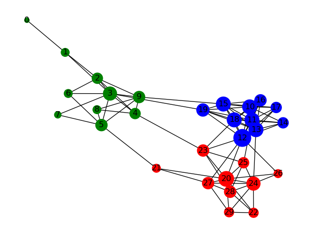

# GraphEvolution
In this project we seek to model a time series of graphs using Deep Network models. We use an equation free approach to modeling in that we translate our graph to some latent space, observe its trajectory, and 
then predict a new datapoint that we can then translate back into the space of graphs.

## Method
For this method we will be using an autoencoder to translate to and from the latent space of graphs. This auto encoder will also have the property that we constrain the latent space to be linear, or time steps in the graph model 
correspond to a linear path in the latent space. We will use a Graph-Transformer to encode the latent represenations of a graph and a Transformer version of GraphRNN to train our decoder.

## Current Results
We have been able to successfully develop an autoencoder that works for small graphs. It is very tempermental with the learning rate and takes a long time to train. We are currently performing a hyperparameter sweep and developing a more scaleable model.

Here are some results from a graph with 30 nodes. This first figure is the graph that was encoded (a Degree Corrected Stochastic Block model). While the second is the generated graph.

The model is able to generate Stochastic Block Models that both follow the degree distribution and clustering patterns of the original. The next step is to constrain the latent space to be linear with regards to pertinent changes in the graph structure.
